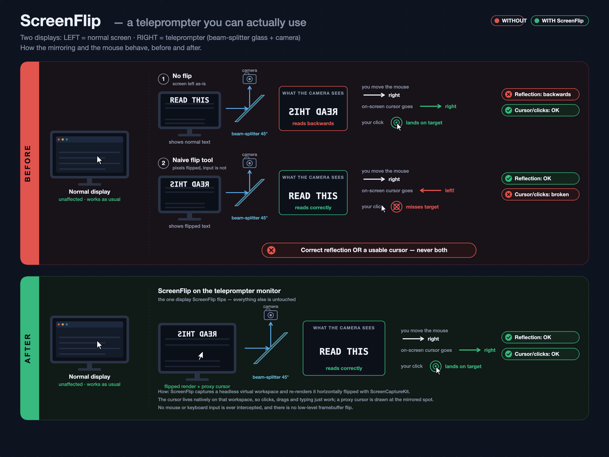

# ScreenFlip

Turn any monitor into a **horizontally‑mirrored display you can actually work on** —
with a cursor that still moves the right way and clicks that land where you expect.

Most "screen flip" tools just capture your screen and redraw it backwards, which
leaves you fighting a mirror‑image cursor. ScreenFlip solves the part everyone skips:
it puts your real windows and the real pointer on a **hidden workspace** and shows
that workspace **flipped, full‑screen** on your chosen monitor, drawing a matching
cursor at the mirrored spot. Move the mouse and it behaves naturally; click and it
hits exactly what you see.

Great for **teleprompters / beam‑splitter glass**, **filming yourself** at a screen
the camera mirrors, and **mirror / practice setups** you still need to operate.



## Platforms

| | Edition | Stack | Status |
|---|---|---|---|
| 🍎 | **[macOS](macos)** | Swift · ScreenCaptureKit · private `CGVirtualDisplay` | Proven (built/tested on Apple Silicon, M3) |
| 🪟 | **[Windows](windows)** | C++ · Direct3D 11 · Windows.Graphics.Capture · IddCx | Architected from the macOS app — see its [caveats](windows/README.md#-read-this-before-expecting-magic) |

Both editions share the same **"Model B"** architecture: a headless **virtual
workspace** hosts your windows and the real cursor; it is captured and re‑drawn
horizontally flipped on the physical monitor; a passive proxy cursor is painted at
the mirrored position; and there is **no input interception** anywhere — clicks,
drags and typing are all native. Display arrangement is saved on launch and restored
on quit.

The big platform difference is the virtual display:

- **macOS** uses the private, driver‑free `CGVirtualDisplay`.
- **Windows** has no driver‑free equivalent, so the full experience uses an **IddCx**
  virtual‑display driver (an existing signed community one, or the bundled
  [`windows/driver`](windows/driver)); without one it falls back to a degraded "mirror
  another display" mode. See the [Windows notes](windows/README.md) and
  [`windows/SPEC.md`](windows/SPEC.md).

## Repository layout

```
screenflip/
├── macos/      # macOS edition (Swift) — build.sh, Sources/, prebuilt build/
├── windows/    # Windows edition (C++) — build.bat, src/, driver/, SPEC.md
├── assets/     # shared marketing images
└── README.md   # you are here
```

## Quick start

- **macOS** → [`macos/README.md`](macos/README.md) — `cd macos && ./build.sh`
- **Windows** → [`windows/README.md`](windows/README.md) — `cd windows && build.bat`

## Help & feedback

Questions, bug reports, or ideas? Email **vladimir@vbar.io**.

## License

Provided as‑is, for personal use. No warranty.
